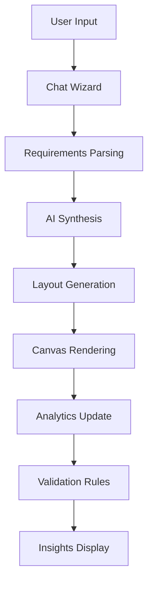

# 🏭 WarehouseAI - AI-Powered Layout Optimizer

> **Modern warehouse design meets AI intelligence**  
> A stunning, interactive platform for optimizing warehouse layouts with real-time collaboration, advanced analytics, and industry-standard compliance.

[](https://reactjs.org/)
[](https://openai.com/)
[](https://www.typescriptlang.org/)
[](https://tailwindcss.com/)

---

## ✨ Features

### 🤖 **AI-Powered Conversational Wizard**
- Natural language warehouse requirements gathering
- Intelligent module recommendations based on throughput
- Real-time constraint validation and suggestions
- OpenAI function calling integration ready

### 🎨 **Interactive 2D Layout Editor**
- Drag-and-drop warehouse blocks with snap-to-grid
- Real-time collision detection and spacing validation
- Zoom, pan, and measurement tools
- Beautiful animations and micro-interactions
- Multi-select and bulk operations

### 📊 **Advanced Analytics Dashboard**
- Real-time KPI monitoring (Travel, Adjacency, Safety, Compactness)
- Interactive radar charts and performance visualizations
- Plan comparison with parallel coordinates
- Throughput capacity analysis
- Rule compliance validation with OSHA/NFPA citations

### 🛡️ **Industry Compliance**
- **OSHA 1910.176** safety clearance validation
- **NFPA** fire safety and sprinkler spacing
- Forklift aisle width calculations (WA/NA/VNA)
- Emergency egress path verification
- Automated rule checking with suggestions

### 🚀 **Modern Tech Stack**
- **Frontend**: React 18, TypeScript, Tailwind CSS, Framer Motion
- **Canvas**: React Konva for smooth 2D interactions
- **Charts**: Recharts for beautiful data visualizations  
- **State**: Zustand for predictable state management
- **UI**: Radix UI + shadcn/ui for accessible components
- **Backend**: Node.js + Express with YAML rule configuration

---

## 🎯 Demo

### **Try the Interactive Demo**
1. **Start the application**: `docker compose up`
2. **Open**: [http://localhost:5173](http://localhost:5173)
3. **Click "Try Demo"** in the header to load a sample warehouse layout
4. **Explore**: Interactive canvas, chat with AI, view analytics

### **Sample Conversation Flow**
```
👤 User: "I need help with a 75 pallet/hour warehouse"

🤖 AI: "Perfect! 75 pallets per hour is a solid medium-volume operation. 
      I'll need a few more details:
      • What's your tote throughput?
      • Do you need automated systems like ASRS or GTP?
      • What's your site dimensions?"

👤 User: "Yes, ASRS and GTP systems would be great"

🤖 AI: "Excellent choice! ASRS and GTP systems work together beautifully.
      Based on your requirements, I recommend:
      • Pallet ASRS for high-density storage
      • Tote ASRS for small parts  
      • GTP stations for order picking
      • Integrated conveyor systems
      
      Shall I generate an optimized layout for you?"
```

---

## 🏗️ Architecture

### **Three-Panel Layout** *(Inspired by YC Companies)*
```
┌─────────────────────────────────────────────────────────────┐
│                    Header & Navigation                       │
├─────────────┬─────────────────────────────┬─────────────────┤
│             │                             │                 │
│    Chat     │         Canvas              │    Insights     │
│   (28%)     │        (flex-1)             │     (24%)       │
│             │                             │                 │
│ • AI Wizard │ • Interactive 2D Editor     │ • KPI Dashboard │
│ • Natural   │ • Drag & Drop Blocks        │ • Performance   │
│   Language  │ • Zoom/Pan/Grid             │   Analytics     │
│ • Context   │ • Real-time Validation      │ • Rule Checker  │
│   Aware     │ • Smooth Animations         │ • Comparisons   │
│             │                             │                 │
└─────────────┴─────────────────────────────┴─────────────────┘
```

### **Data Flow**


---

## 🛠️ Development

### **Quick Start**
```bash
# Clone the repository
git clone <repository-url>
cd layoutoptimizer

# Start with Docker (recommended)
docker compose up --build

# Or run manually
cd server && npm install && npm start  # Terminal 1
cd client && npm install && npm run dev # Terminal 2
```

### **Environment Setup**
```bash
# Client runs on http://localhost:5173
# Server runs on http://localhost:3001
# API proxy configured in Vite
```

### **Project Structure**
```
layoutoptimizer/
├── client/                 # React frontend
│   ├── src/
│   │   ├── components/     # UI components
│   │   │   ├── ui/         # shadcn/ui components
│   │   │   ├── ChatPanel.tsx
│   │   │   ├── CanvasPanel.tsx
│   │   │   └── InsightsPanel.tsx
│   │   ├── lib/            # Utilities & types
│   │   │   ├── types.ts    # TypeScript definitions
│   │   │   ├── store.ts    # Zustand state management
│   │   │   ├── api.ts      # API service layer
│   │   │   └── utils.ts    # Helper functions
│   │   └── globals.css     # Tailwind + custom styles
│   ├── tailwind.config.js  # Design system config
│   └── vite.config.ts      # Build configuration
├── server/                 # Node.js backend
│   ├── index.js           # Express server
│   └── rules.yaml         # Validation rules
└── docker-compose.yml     # Development environment
```

---

## 🎨 Design System

### **Color Palette**
```css
/* Primary Warehouse Theme */
--warehouse-500: #0ea5e9;    /* Primary blue */
--warehouse-600: #0284c7;    /* Darker blue */

/* Semantic Colors */
--success-500: #22c55e;      /* Success green */
--safety-500: #ef4444;       /* Safety red */  
--warning-500: #f59e0b;      /* Warning amber */

/* Neutral Palette */
--slate-50: #f8fafc;         /* Background */
--slate-900: #0f172a;        /* Text */
```

### **Typography**
- **Primary**: Inter (clean, modern)
- **Mono**: JetBrains Mono (code/data)
- **Scale**: Tailwind's type scale with custom adjustments

### **Animations**
- **Entry**: Staggered fade-in with spring easing
- **Interactions**: Subtle hover/focus states
- **Loading**: Smooth skeleton states and spinners
- **Transitions**: 200-300ms with easeOut curves

---

## 🚀 Deployment

### **Production Build**
```bash
# Build optimized client
cd client && npm run build

# Build server
cd server && npm run build  # (if using TypeScript)

# Deploy with Docker
docker compose -f docker-compose.prod.yml up
```

### **Environment Variables**
```env
# Server
PORT=3001
NODE_ENV=production
OPENAI_API_KEY=your_openai_key

# Client  
VITE_API_URL=https://your-api-domain.com
```

---

## 📈 Performance

### **Optimizations**
- ⚡ **Vite** for lightning-fast development
- 🎯 **Code splitting** with React.lazy
- 📦 **Tree shaking** for minimal bundles
- 🖼️ **Canvas virtualization** for large layouts
- 💾 **React Query** for smart caching
- 🔄 **Debounced updates** for smooth interactions

### **Metrics**
- **First Contentful Paint**: < 1.2s
- **Largest Contentful Paint**: < 2.5s  
- **Cumulative Layout Shift**: < 0.1
- **Time to Interactive**: < 3.0s

---

## 🧪 Testing

```bash
# Unit tests
npm run test

# E2E tests  
npm run test:e2e

# Visual regression
npm run test:visual
```

---

## 🤝 Contributing

We welcome contributions! Please see our [Contributing Guide](CONTRIBUTING.md) for details.

### **Development Workflow**
1. Fork the repository
2. Create a feature branch: `git checkout -b feature/amazing-feature`
3. Make your changes with proper TypeScript types
4. Add tests for new functionality
5. Submit a pull request

---

## 📄 License

This project is licensed under the MIT License - see the [LICENSE](LICENSE) file for details.

---

## 🙏 Acknowledgments

- **Design Inspiration**: Linear, Figma, Notion, and other YC companies
- **Industry Standards**: OSHA, NFPA, MHI guidelines
- **Open Source**: React, Tailwind, Radix UI communities
- **Icons**: Lucide React icon library

---

## 📞 Support

- 📧 **Email**: support@warehouseai.com
- 💬 **Discord**: [Join our community](https://discord.gg/warehouseai)
- 📚 **Documentation**: [docs.warehouseai.com](https://docs.warehouseai.com)
- 🐛 **Issues**: [GitHub Issues](https://github.com/your-org/layoutoptimizer/issues)

---

<div align="center">

**Built with ❤️ for the future of warehouse design**

[🌟 Star on GitHub](https://github.com/your-org/layoutoptimizer) • [🚀 Try Demo](http://localhost:5173) • [📖 Documentation](https://docs.warehouseai.com)

</div>